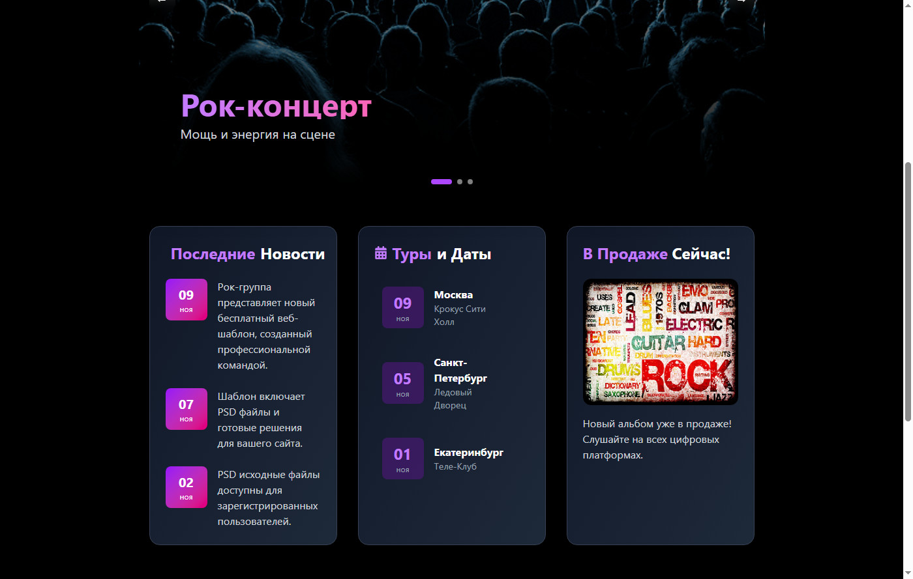
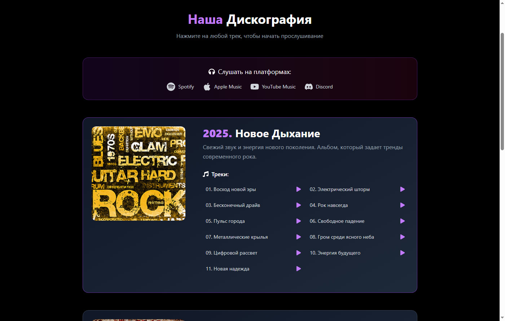
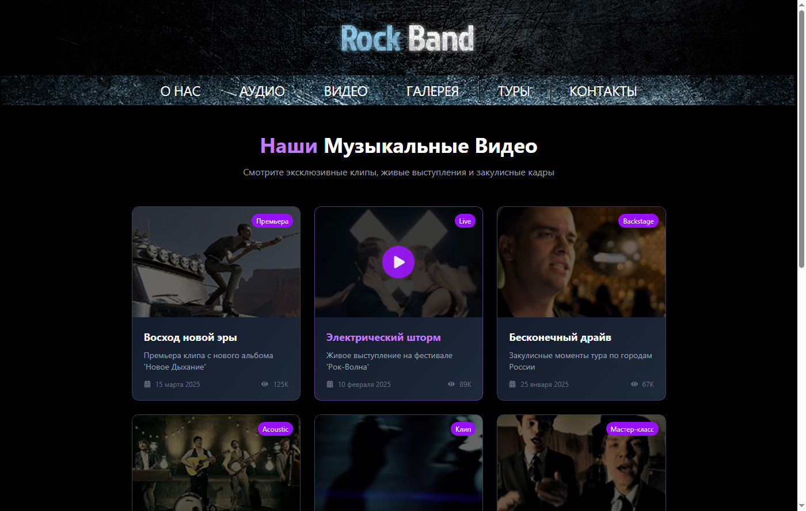
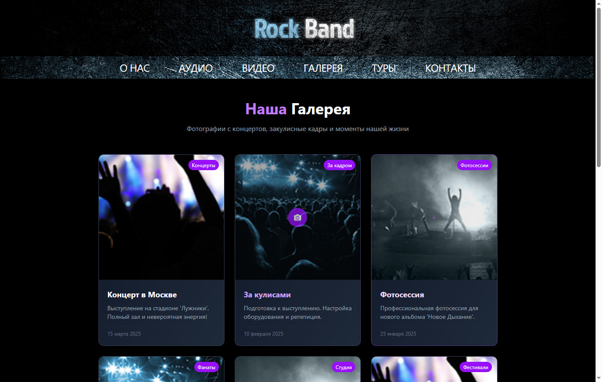
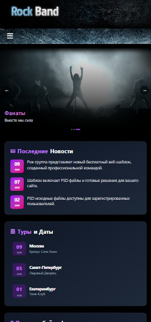
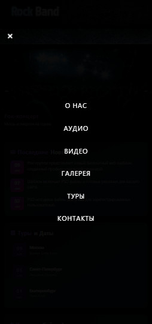

# Rock Band - Сайт рок-группы


## О проекте

Сайт рок-группы с музыкальным плеером, видеогалереей и фотогалереей. Проект создан для портфолио и демонстрации навыков веб-разработки.

## Демо

🔗 [Посмотреть сайт](https://semeeensemeeenov23.github.io/rock-band/)

## Функционал

### 🎸 Главная страница
- Слайдер с фотографиями
- Видео-плеер (модальное окно)
- Новости и анонсы туров

### 🎵 Аудио
- Плеер с управлением (play/pause, громкость, прогресс-бар)
- Дискография с тремя альбомами
- Список треков

### 🎬 Видео
- Галерея видеоклипов
- Модальное окно с плеером
- Автоматическое воспроизведение

### 📸 Галерея
- Фотографии с концертов
- Модальное окно для просмотра
- Авто-слайдшоу

### 🗓️ Туры
- Ближайшие концерты
- Статусы билетов
- Архив прошедших туров

### 📧 Контакты
- Форма обратной связи
- Карта Google Maps
- Контактная информация

### ✨ Дополнительно
- **Адаптивный дизайн** (мобильные устройства)
- **Бургер-меню** для мобильных
- **Плавающая гифка** (появляется через 15 сек бездействия)
- **Анимации** (Framer Motion)

## Скриншоты

### Десктоп версия

| Главная страница | Аудио страница |
|-----------------|----------------|
|  |  |

| Видео страница | Галерея |
|----------------|---------|
|  |  |

### Мобильная версия

| Главная (мобильная) | Меню (мобильное) |
|---------------------|------------------|
|  |  |

## Технологии

- **React 19** + TypeScript
- **Vite** (сборщик)
- **Tailwind CSS 4** (стилизация)
- **Framer Motion** (анимации)
- **React Icons** (иконки)

## Установка и запуск

```bash
# Клонировать репозиторий
git clone https://github.com/semeeensemeeenov23/rock-band.git

# Перейти в папку проекта
cd rock-band

# Установить зависимости
npm install

# Запустить проект локально
npm run dev